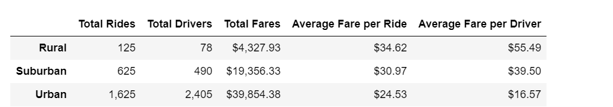
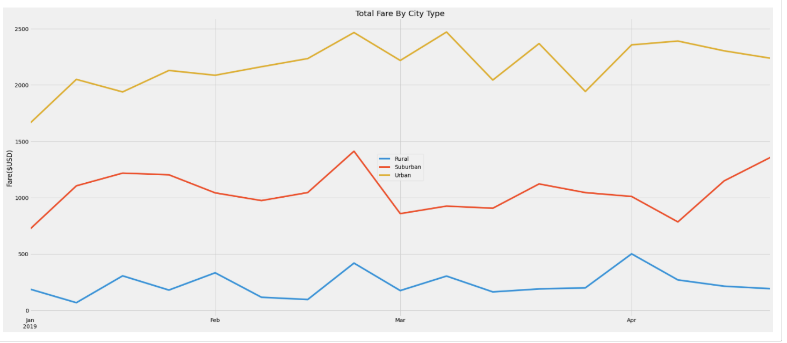

# PyBer_Analysis

## Overview of Project

### Purpose
The purpose of this analysis to see how the fares of rides fluctuate for 3 
different city types over a period of 4 months. 

## Results

### How the Total Rides, Total Drivers, Total Fares and Average Fare per Ride and Driver fluctuate. 
1. We notice here that Urban cities had almost 70% of the rides whereas rural had only 5%. 
2. It also tells us that there were more number of drivers available in Urban type of city(~80%)
3. As there were more number of rides completed in Urban type of city we notice that the sum of fares for Urban was the most. 
4. The contrasting point is the average fare for each ride in Urban city is less than Rural and Suburban city type.
   Rural city type has highest average fare. 
   It can be assumed that as Rural city type has less number of rides, the average fare per ride is more. 
5. Same thing can be said about average fare per driver is least in Urban cities because total rides are more. 
   Average fare per driver in Rural cty is almost 3 times than Urban city. 

6. From the "Total Fares By City Type" graph we see that the fare of rides kept on increasing from January till 3rd week of February. 
   Till 3rd week of February, the cumulative fare reached uptil $2500 and in March it kept on fluctuating.
7. For Rural cities, the ride fare was almost stable between 0 to $400 and only during start of April it reached to $500. 
8. For Suburban cities, the cumulative ride fare was between  $750 to $1400. The fares were on the higher side during the first 8 weeks of 2019.   

## Summary

1. Business Proposal :

